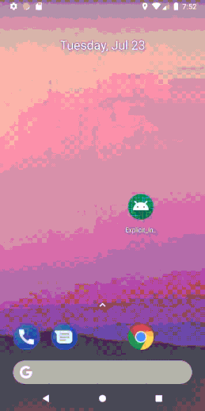

# Manage Navigation using Explicit Intent & Passing data to second Activity.



## Introduction

The purpose of this app is to understand what really is an Explicit Intent, how to pass data between activities using intent.putExtra and how to add back button on action bar using manifest file.

## Explicit Intent

When you use an intent to nagivate to an activity within your own application, that's called an explicit intent.\

In this project we are making an explicit intent from MainActivity.java to Activity_2.java class.

To make an explicit intent using a button in mainactivity we have to add the following code inside `button.setOnClickListener` :  

```
Intent intent = new Intent(MainActivity.this,Activity_2.class);
startActivity(intent);
```

## Send Data to Activity

Every intent object has a data property that is typed as a URI, Uniform Resource Identifier, you can also pass data in the form of what are known as extras.

Here we are sending values from MainActivity.java to Activity_2.java class on click of a button in main activity by following this code :

```
        button.setOnClickListener(new View.OnClickListener() {
            @Override
            public void onClick(View v) {
                Intent intent = new Intent(MainActivity.this,Activity_2.class);
                intent.putExtra(FIRST_NAME,"Matt");
                intent.putExtra(LAST_NAME,"Simons");
                startActivity(intent);
            }
        });
```

This is how we send value using `.putExtra(KEY,"VALUE")`, It's how we refer to this value in both activities using KEY, where is KEY is constant.

`
   intent.putExtra(FIRST_NAME,"Matt");
                intent.putExtra(LAST_NAME,"Simons");
`

#### Receiving Data.

```
//Activity_2.java.
        Intent intent = getIntent();
        String firstName = intent.getStringExtra(MainActivity.FIRST_NAME);
        String lastName = intent.getStringExtra(MainActivity.LAST_NAME);

```

## Adding Back Button to Child Activity using AndroidManifest.xml

```
<activity android:name=".Activity_2">
            <meta-data
                android:name="android.support.PARENT_ACTIVITY"
                android:value=".MainActivity"/>
        </activity>
```
# Thank You.
